## Buka Github kalian di browser yang kalian gunakan

## Lalu klik icon profil yang ada di sebelah pojok kanan atas 
## Pilih opsi "Organizations" 

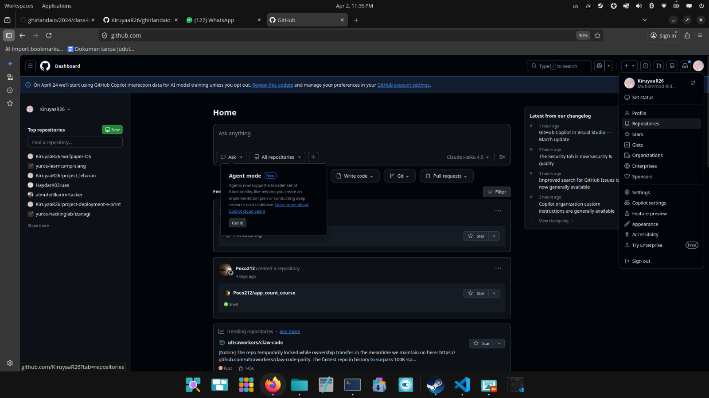

## Pilih "worker-sentinel"

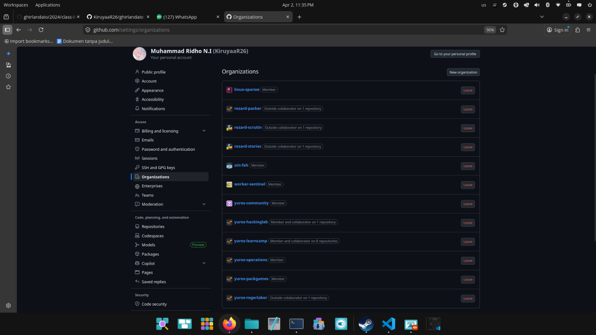

## Pilih "ghirlandaio"

## Pilih "Fork" yang ada di bagian kanan 

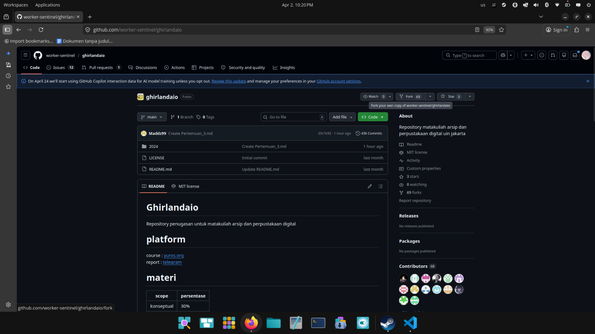

## Klik "creat fork" yang ada di bagian kanan bawah

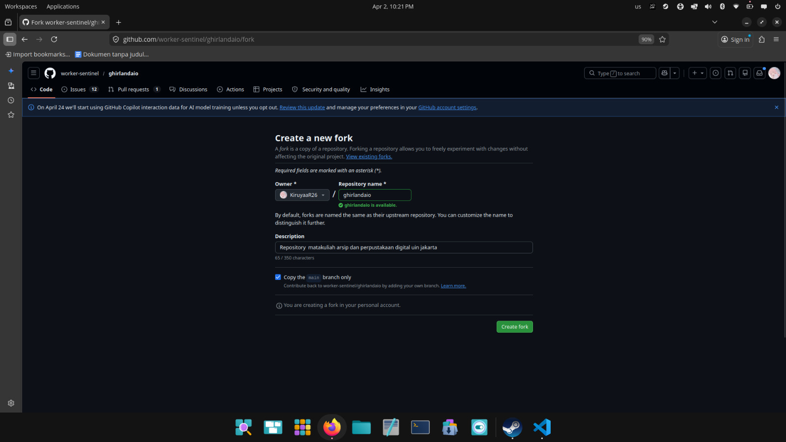

## Pastikan di sebelah kiri atas sebelah logo github adalah nama user github kalian

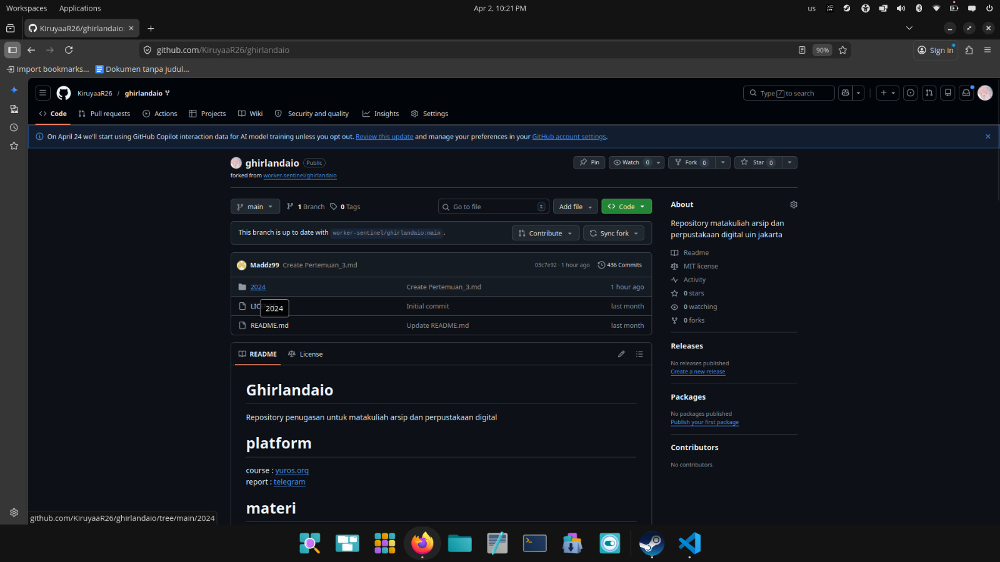

## Lalu klik folder "2024" 

## Klik folder "class-b"

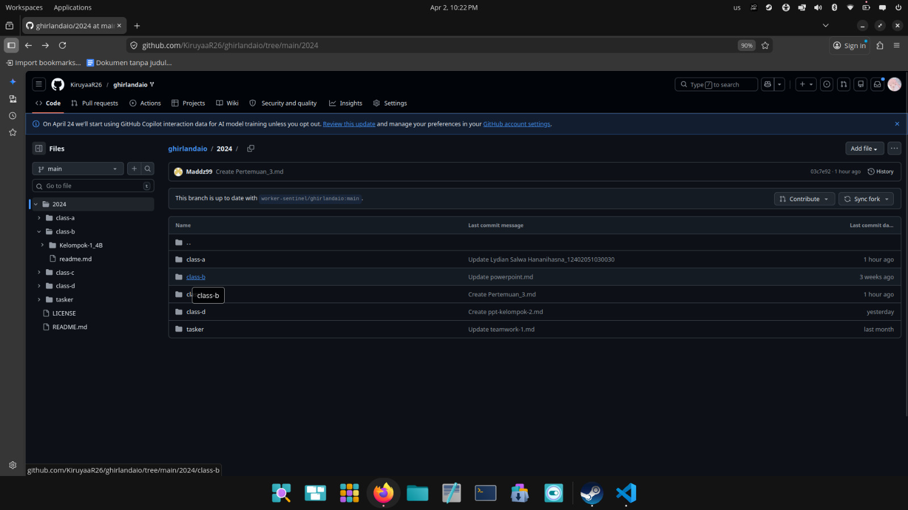

## Klik Folder "mandiri"

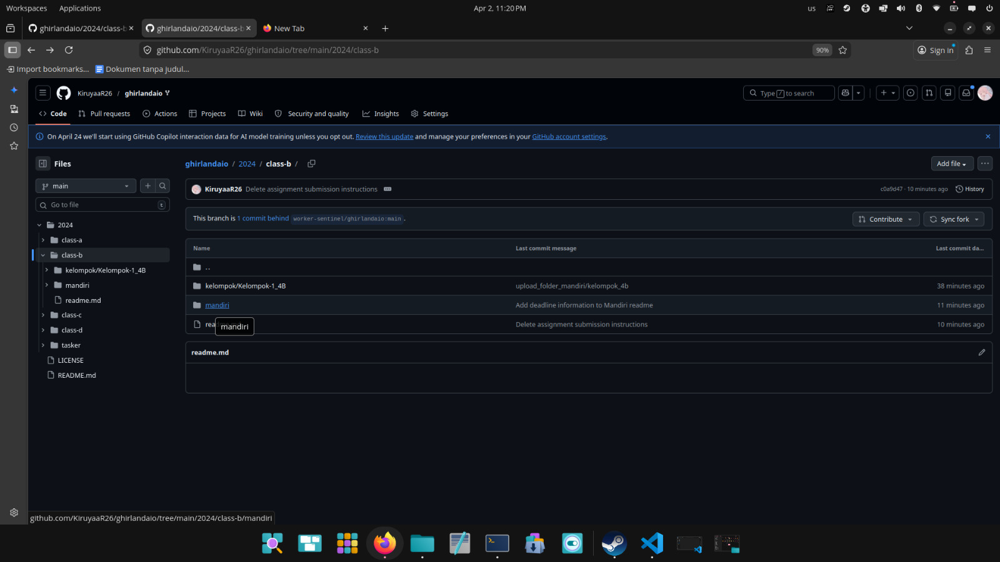

## Klik "Add file" yang ada di bagian sebelah kanan

## Lalu klik "Create  new file" 

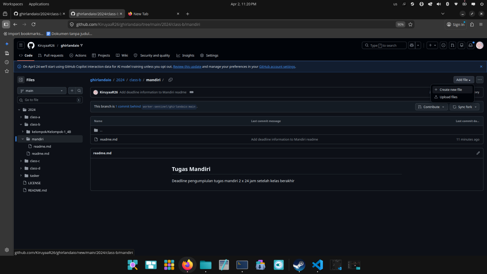

## Lalu ada kolom biru, isi dengan "nama kalian / nama_pertemuan.md"

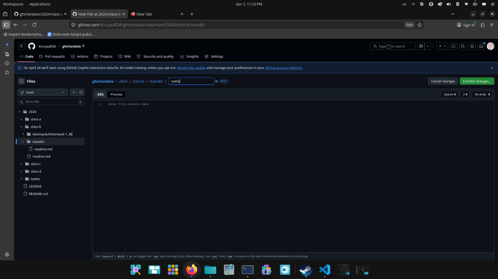

## Silahkan kalian buat resumenya di situ dengan format md

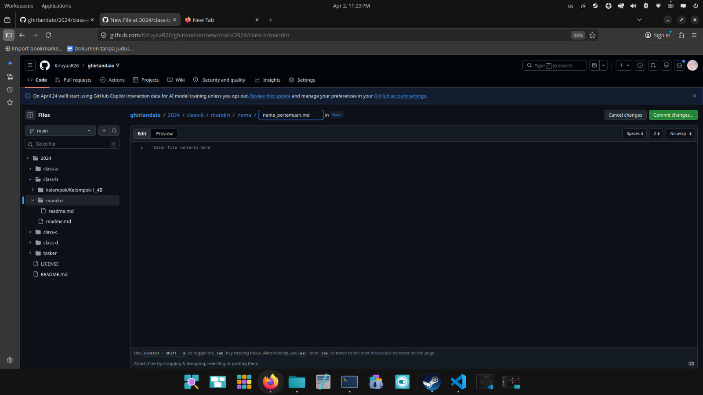

## Dibagian atas kiri kolom untuk membuat resume ada 2 opsi "Edit" , "Preview" 

## "Edit" untuk mengetik resumenya dan "Preview" untuk melihat visual dari format md kalian

## Setelah selesai membuat resume kalian klik "Commit change" yang ada di atas kanan berwarna hijau  

## Lalu klik "Commit changes" 

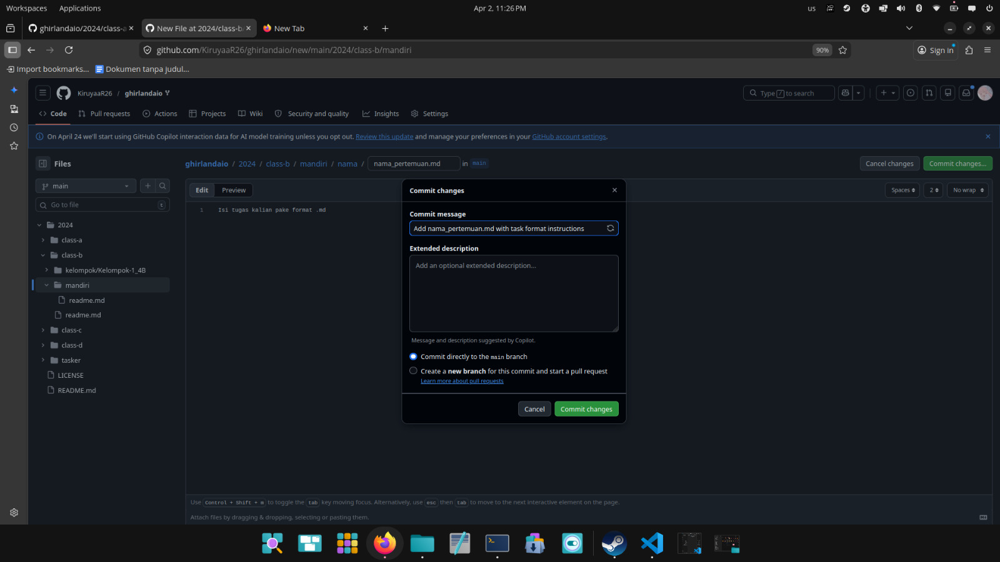

## Setelah itu klik "Code" yang ada di bagian kanan atas 

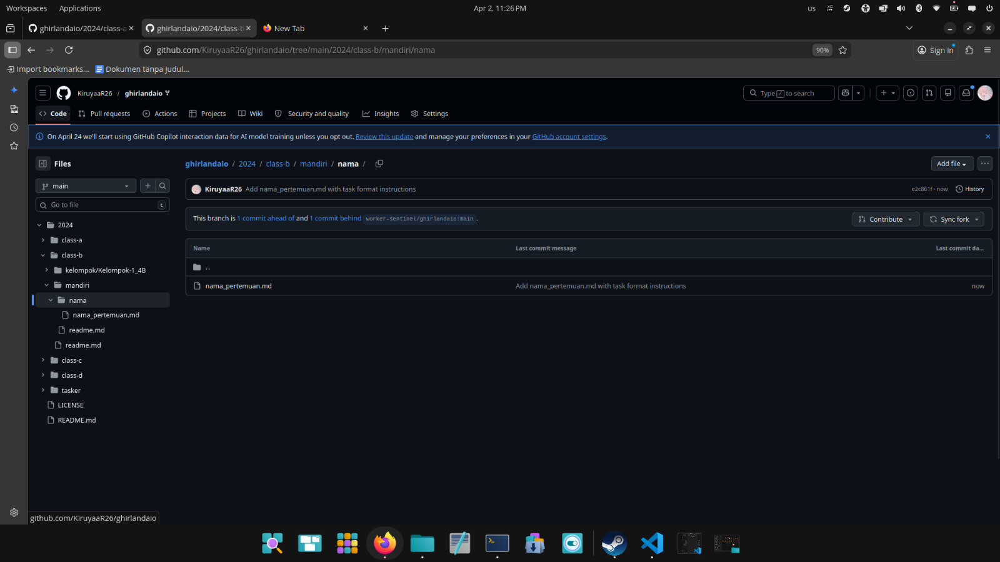

## Klik "Contribute"

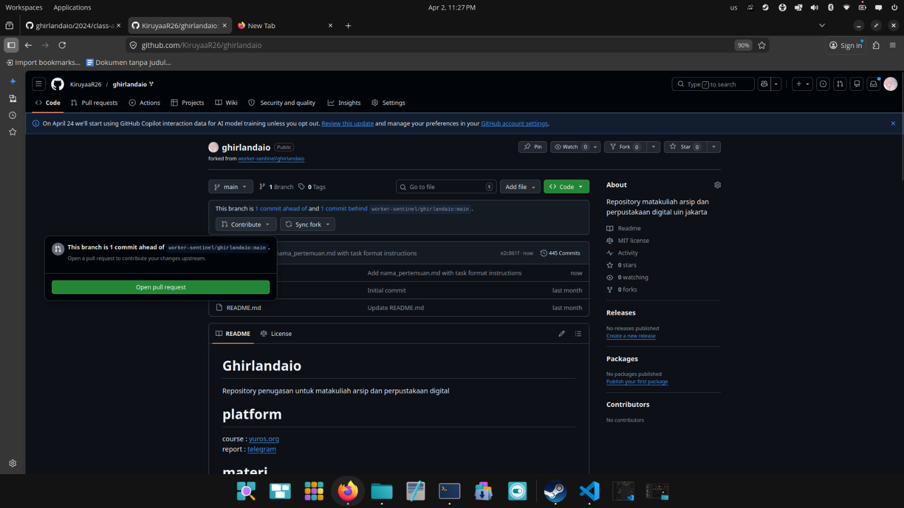

## Lalu klik "Open Pull Request" 

## Di dalam kolom  "Add a title" masukkan nama_pertemuan

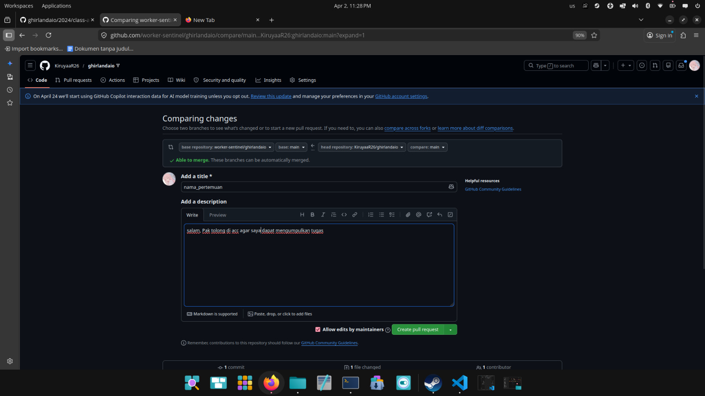

## Jangan lupa isi "Add a description" dengan kata yang sopan 

## Lalu klik "Create pull request" yang berwarna hijau

## Lalu tunggu sampai ada kata "No conflicts with base branch" 

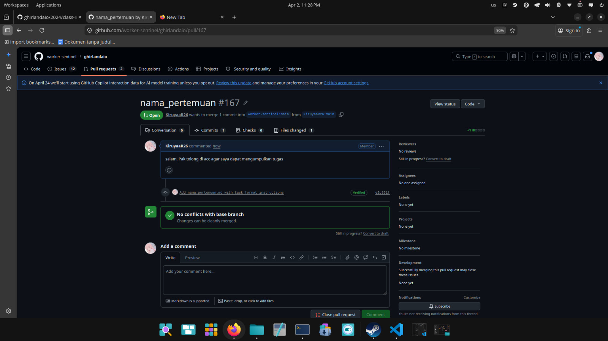

## Lalu klik icon profile yang ada di pojok atas kanan dan pilih repositories

## Pilih "repository ghirlandaio" 

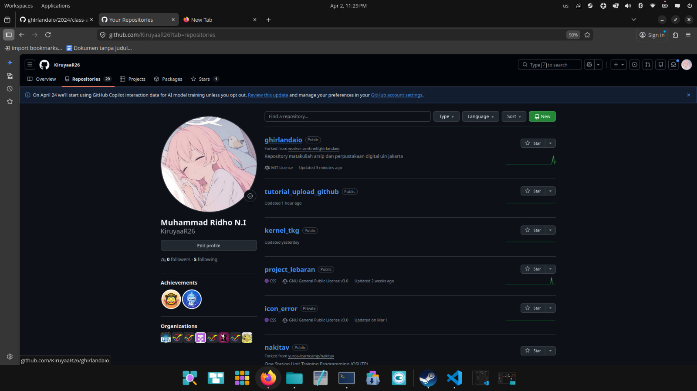

## Pilih "Sync fork" dan klik "Update branch" yang berwana hijau

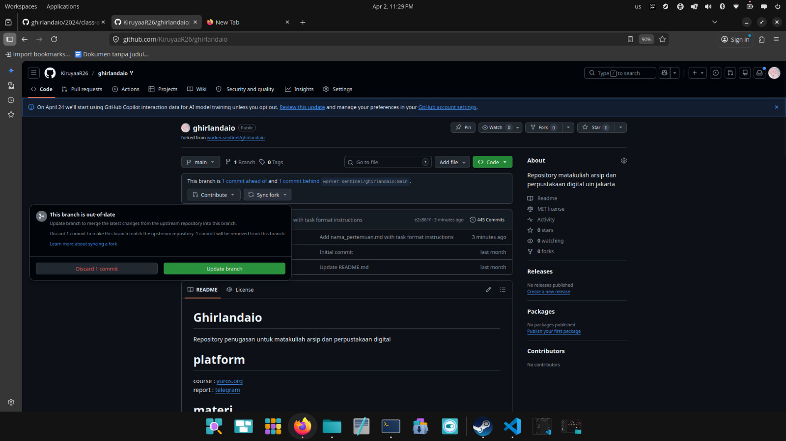

## Kli "Sync fork" lagi dan tunggu sampai ada ceklis hijau 

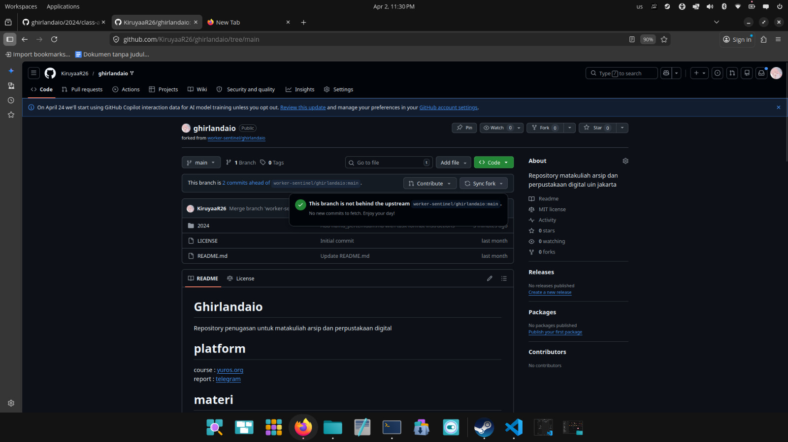

## Selamat kalian sudah berhasil mengupload tugas!! 
